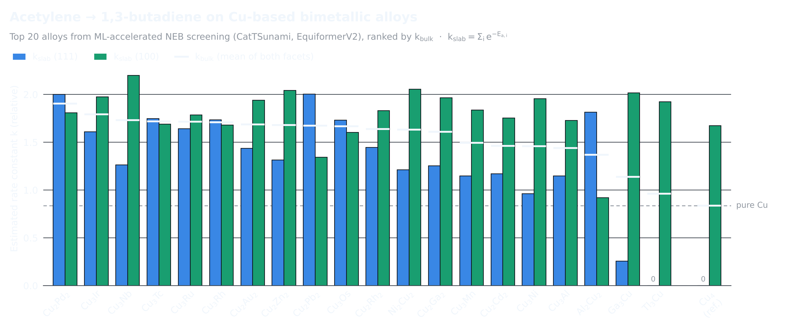

# Cu-Alloy Catalyst Screening with ML Interatomic Potentials

Automated screening of **108 copper-based bimetallic alloy surfaces** for C-C coupling catalysis, using equivariant machine-learning interatomic potentials (MLIPs) from the [Open Catalyst Project](https://opencatalystproject.org/) instead of DFT.

## Key results


*Estimated rate constant k_bulk averaged across (111) and (100) surfaces; pure Cu₄ shown for reference.*

- Screened 388 bulk alloy structures from the Materials Project across 3 coupling reactions
- Identified the **20 most promising Cu alloys** for butadiene electroreductive synthesis from acetylene, with **Cu₂Pd₂** showing roughly twice the predicted activity of pure copper
- Set up three new coupling reactions for selective ethylene synthesis (top candidates: Cu₂Au₂, Cu₂Ag₂, Ag₃Cu)
- Energy barriers estimated via NEB with the EquiformerV2 MLIP, replacing expensive DFT calculations (~45 GPU-days total)

## Method

1. **Bulk retrieval** – Query the Materials Project for Cu-containing binary alloys; filter by stability and symmetry
2. **Slab generation** – Enumerate low-index surfaces for each bulk using `fairchem.data.oc`
3. **Adsorbate placement** – Place reactant and product adsorbates on each slab with `AutoFrameCoupling`
4. **Relaxation** – Relax adsorbate–slab systems using EquiformerV2 via the `OCPCalculator` (ASE interface)
5. **NEB** – Compute minimum-energy pathways between reactant and product states with the `OCPNEB` wrapper
6. **Ranking** – Rank alloys by activation energy barrier for each reaction

## Repository layout

```
src/
  main.py                          # End-to-end screening pipeline (relaxation + NEB)
  parameter_sweep.py               # Parameter exploration (interpolation method, spring constant, distances)
  autoframe.py                     # Adsorbate placement on slab surfaces
  ocpneb.py                        # NEB wrapper around fairchem's OCPCalculator
  reaction.py                      # Reaction database interface
scripts/                           # SLURM / cluster submission scripts
notebooks/
  data_retrieval.ipynb             # Query Materials Project for bulk structures; set up adsorbate databases
  bulk_filtering.ipynb             # Filter and prepare Cu-containing alloy structures for screening
  reaction_setup_and_analysis.ipynb  # Define coupling reactions, run exploratory NEB, analyse results
data/
  adsorbates/                      # XYZ files for each adsorbate species
figures/                           # Result plots
```

## Reproducing

> **Note:** The MLIP relaxations and NEB calculations use EquiformerV2, which requires a CUDA-capable GPU (`pytorch-cuda=12.1`).

```bash
# 1. Create the environment
conda env create -f env.gpu.yml
conda activate ecat

# 2. Retrieve bulk structures from the Materials Project
#    (requires a free API key from https://materialsproject.org)
cd notebooks
jupyter notebook data_retrieval.ipynb

# 3. Run the screening pipeline
cd ../src
python main.py --bulks_file ../data/select_bulks.csv \
               --reaction "*CH2 + *CH -> *CH2CH"
```

See `data/README.md` for details on included vs. generated data files.

## Built with

- [fairchem / Open Catalyst](https://github.com/FAIR-Chem/fairchem) – EquiformerV2 MLIP and slab/adsorbate utilities
- [ASE](https://wiki.fysik.dtu.dk/ase/) – Atoms, optimizers, NEB
- [Materials Project API](https://materialsproject.org) – Bulk crystal structures

## Context

CH-492 Project in molecular sciences Ia (MA1, autumn 2025), Master in Biological and molecular chemistry at EPFL, conducted in collaboration with the [Laboratory of Inorganic Artificial Catalysis (LIAC)](https://www.epfl.ch/labs/liac/). Full write-up in the [report](docs/Project_Ia_Rossboth_Cedric.pdf).

This project builds on **EleCatML**, a workflow developed by
[Junwu Chen](https://github.com/jwchen25) for screening electrocatalytic
C–C coupling reactions with machine-learned interatomic potentials.

**Junwu Chen** — original pipeline (2024–2025)
- Workflow design and core implementation (`main.py`, workflow notebook)
- Bulk structure extraction from the Materials Project and Cu alloy structure set
- Adsorbate and coupling-reaction definitions
- NEB path visualization, multiprocessing version, result reloading
- HPC batch scripts and environments

**Cédric Rossboth** — Cu bimetallic alloy study (2025, summer 5-week project)
- More robust IDPP interpolation, multiple-pathway screening, and faster NEB
  with a SafeLBFGS optimizer
- Parameter-screening script
- Three new coupling reactions for selective ethylene synthesis
- Screening of Cu alloys, identifying the 30 best candidates for butadiene
  electrosynthesis from acetylene (see `docs/` for the report)
- Restructuring and cleanup for public release

## License

MIT – see [LICENSE](LICENSE).
